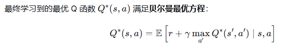
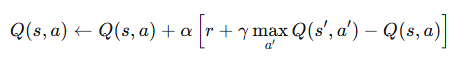
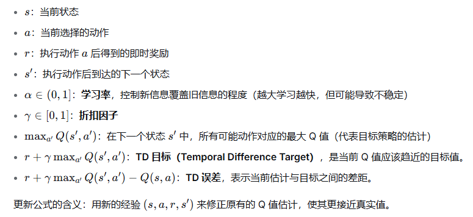
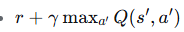
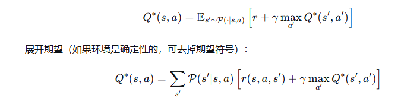
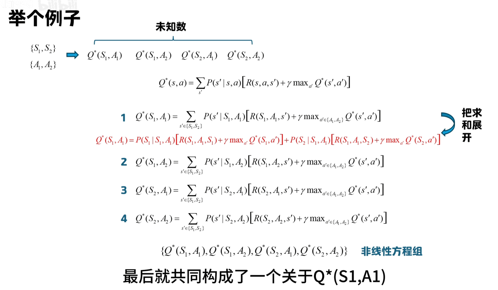

# Q-learning 算法详解

1. Q-learning 是一种无模型（model-free）、基于值（value-based） 的强化学习算法。它的核心思想是：通过学习一个动作价值函数  Q(s,a) 来评估在状态  s 下采取动作  a 的好坏程度（即期望的累计奖励），然后根据  Q 值选择最优动作。

2. 特征：  
- 无模型：意味着智能体不需要知道环境的动态模型（即状态转移概率和奖励函数），而是直接通过与环境的交互来学习。
- 基于值：算法直接学习值函数，然后从中提取策略（通常选择  Q 值最大的动作）。
- 

3. Q-learning 更新公式
- 

  - 解释：  
    1. Q(s,a)是当前对状态-动作对的价值估计（旧值）。  
    2. 是TD 目标，它基于当前经验给出了一个更准确的估计（理想情况下应该等于真实的最优 Q 值）。
    3. 括号内的整体称为 TD 误差，表示当前估计与目标之间的差距。整个公式相当于新估计=旧估计+α×(目标值−旧估计)，这是一种增量更新，目的是让旧估计朝着目标值靠近一小步，而不是直接跳到目标值。
    4. 其实这个与随机森林或者随机梯度下降的思想是类似的，都是通过不断迭代来逼近最优解。为了平滑的更新，通常会使用一个学习率  α 来控制每次更新的步长，防止过度调整导致不稳定。
    5. 一个直观类比
    > 假设你估计今天的气温是 20 度（旧估计）。你得到一个更准确的信息：实际气温应该是 25 度（目标值）。根据这个新信息修正你的估计：比如你相信新信息有 80% 的可靠性，那么你会把估计调整为 20+0.8×(25−20)=24 度。这就是增量更新的思想。
4. Q-learning 算法流程
- 初始化：
初始化 Q-table，通常将所有 Q(s,a) 设为 0 或小的随机值。
设定学习率 α、折扣因子 γ、探索率 ϵ（用于 epsilon-greedy 策略）。
- 对每个 episode（回合）重复：
  1. 初始化状态 s（通常为起始状态）。
  2. 对每个 step（时间步）重复，直到 s 为终止状态：
      - 根据当前 Q 值，使用 epsilon-greedy 策略选择动作 a：
         - 以概率 ϵ 随机选择一个动作（探索）。
         - 以概率 1−ϵ 选择 最优的Q(s,a)（利用）
  3. 执行动作 a，观察奖励 r 和下一个状态 s'。
  4. 更新 Q(s,a)：
      - Q(s,a) ← Q(s,a) + α [r + γ max_{a'} Q(s',a') - Q(s,a)]
  5. 直到 s' 是终止状态或者Q收敛，结束当前 episode。
  6. 注意：在更新时，我们并不直接使用实际执行的动作（因为下一步的动作可能不是最大 Q 值对应的动作），而是使用下一个状态的最大 Q 值，这正是 Q-learning 被称为离策略（off-policy）算法的原因。

# 知识点 
1. 无模型状态和动作价值函数  
无模型≠没有奖励，而是不知道奖励的产生规律（奖励函数形式）。 无模型方法直接使用与环境交互产生的样本 (s,a,r,s) 来学习，不需要事先知道环境的数学模型。
2. 贝尔曼最优方程
  
最优动作价值函数Q∗(s,a)：从状态  s 采取动作  a 所能获得的最大期望累计奖励  
  
3. 离策略的含义
离策略（off-policy） 指的是：学习的目标策略（最终要得到的策略）与生成数据的行为策略可以是不同的。  
  > 行为策略：智能体与环境交互、采集经验时实际使用的策略。在 Q-learning 中，通常使用 ϵ-greedy 策略，它既会利用当前 Q 值选择最优动作（概率 1−ϵ），也会随机探索（概率 ϵ）。行为策略负责产生数据，它需要保证足够的探索。  
    目标策略：我们希望学习到的最优策略，通常是贪婪策略，即在每个状态选择 Q 值最大的动作。\
  
   - Q-learning 的更新公式中使用了max_{a'} Q(s',a') 而不是 Q(s',a')，这这相当于假设在下一个状态我们遵循的是贪婪策略（目标策略），而不是行为策略。因此，即使行为策略由于探索而选择了非最优动作，更新时依然使用目标策略下的 Q 值，从而实现了从行为策略产生的数据中学习目标策略。这正是离策略的核心。

# 题目
## 第一题
环境描述：
一个 4×4 的网格世界

    格子类型：
    S：起点 (0,0)
    F：可行走的冰冻湖面
    H：洞，掉进去就失败， episode 结束
    G：目标 (3,3)
    动作：4 个离散动作（0:左，1:下，2:右，3:上）
    特性：环境是滑冰性质的——你有一定概率滑到相邻格子（而不是你想去的方向）。具体来说：如果选择某个方向，有 1/3 的概率直行，1/3 的概率向左偏，1/3 的概率向右偏（上下左右对应的偏移方向是固定的）。这增加了随机性，让问题更有趣。
    奖励：
    到达目标 (G)：+1
    其他所有情况（包括掉进洞、正常行走）：0
    终止条件：到达目标或掉进洞。
    目标：让智能体学会从起点出发，安全地到达目标，获得 +1 奖励。