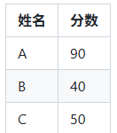
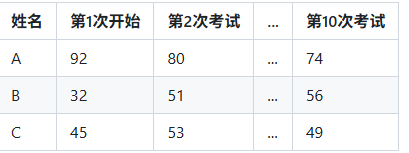

# 原始策略梯度法

我们考虑一个马尔可夫决策过程（MDP）：
状态空间 $\mathcal{S}$
动作空间 $\mathcal{A}$
状态转移概率 $P(s'|s,a)$
奖励函数$r(s,a)$
折扣因子  $\gamma \in [0,1]$

智能体依据策略 $\pi_\theta(a|s)$ 选择动作，其中 $\theta$ 是策略的参数,产生一条轨迹：
$\tau = (s_0, a_0, r_1, s_1, a_1, r_2, \dots, s_{T-1}, a_{T-1}, r_T, s_T)$

轨迹的累积折扣回报：$R(\tau) = \sum_{t=0}^{T-1} \gamma^t r_{t+1}$

强化学习的目标是最大化期望回报：

$$
J(\theta) = \mathbb{E}_{\tau \sim p_\theta(\tau)}[R(\tau)]
$$

其中 $p_\theta(\tau)$ 是由策略 $\pi_\theta$ 生成轨迹 $\tau$ 的概率分布。也就是希望存在一个由神经网络参数化的策略 $\pi_\theta$，使得在环境中执行该策略能够获得最大的累积回报。

## 监督分类到优化策略网络

在监督学习中，比如图像分类，我们有一张图片（输入  x）和它的正确标签（比如“猫”）。我们训练一个神经网络，让它输出每个类别的概率  p(类别∣x)。训练的目标是让正确标签的概率越大越好，通常用最小化交叉熵损失来实现：

$$
L(\theta) = -\log p_{\theta}(\text{正确标签} | x)
$$

1. 强化学习的策略网络有什么不同？
   在强化学习中，我们没有正确的标签，而是通过与环境交互来获得奖励。我们希望最大化期望回报 $J(\theta)$，而不是最小化一个损失函数。虽然我们可以定义一个损失函数来优化策略网络，但它通常是基于策略梯度的估计，而不是直接的监督信号。
2. 那么怎么优化策略网络呢？
   策略梯度方法的核心思想是如果某个动作导致了更高的回报，我们就应该增加选择这个动作的概率；反之，如果某个动作导致了较低的回报，我们就应该减少选择这个动作的概率。这不正好和分类问题中的正确标签和错误标签的概念相似：在分类问题中，我们希望增加正确标签的概率，减少错误标签的概率；在强化学习中，我们希望增加那些导致高回报动作的概率，减少那些导致低回报动作的概率。
   可以将$(s_t, a_t)$看作是一个样本，但是样本的标签不是一个固定的类别，而是一个回报值 $R_t$，这个回报值告诉我们这个动作在这个状态下的好坏程度。我们希望增加那些回报值较高的动作的概率，减少那些回报值较低的动作的概率。
3. 如何用监督学习的框架来实现？
   最简单的方法就是将奖励值作为权重来修改分类的损失函数。
    1. 想象收集了一些轨迹数据，里面有状态 $s_t$ 和当时执行的动作 $a_t$。我们可以像分类那样，计算这个动作的负对数似然 $-\log \pi_\theta(a_t|s_t)$（也就是交叉熵损失）。但是，我们不直接最小化它，而是给它乘上一个权重 $A_t$，这个权重反映了动作的好坏（可以是奖励、累计回报或优势）：
    
    $$
    \text{Loss} = -A_t \cdot \log \pi_\theta(a_t|s_t)
    $$
2. 当 $A_t > 0$（好动作）
公式：
$$\text{Loss} = -A_t \log p$$
   如图所示，其中 $p = \pi_\theta(a_t|s_t)$，概率 $p \in (0,1]$，因此 $\log p \le 0$  
   当$A_t > 0$，则 $\text{Loss} = -(\text{正数}) \times (\text{非正数}) \ge 0$，训练目标：**最小化 Loss**，要让 Loss 变小 → 让 $-\log p$ 变小 → 让 $\log p$ 变大 → 让 $p$ 变大  
   最终效果：**提升好动作的选择概率**  
   同理反过来推导当 $A_t < 0$（坏动作）时，训练目标是**增加 Loss**，要让 Loss 变大 → 让 $-\log p$ 变大 → 让 $\log p$ 变小 → 让 $p$ 变小  
   最终效果：**降低坏动作的选择概率**

   3. 区别  
   
    | 对比维度 | 监督学习  | 强化学习 |
    | ------------ | ------------------------------------------ | ------------------------------------------------------ |
    | **数据来源** | 事先收集的、静态的、带标签的数据集         | 智能体与环境实时交互产生的动态轨迹数据                 |
    | **学习目标** | 最小化预测与真实标签之间的误差（如交叉熵） | 最大化期望累积奖励（长期回报）                         |
    | **反馈信号** | 每个样本都有明确的正确标签（监督信号）     | 只有奖励信号（有时稀疏、延迟），没有绝对正确动作       |
    | **加权方式** | 通常所有样本等权，或按类别分布加权         | 根据奖励/优势值加权，好动作加大权重，坏动作减小权重     |
    | **样本效率** | 高：数据集可反复使用（离线学习）           | 低：数据通常仅用于一次更新（在线/同策略），需不断重新采样 |
    | **探索机制** | 无：模型只是拟合已有数据分布               | 必须探索：尝试新动作以发现更高回报，平衡探索与利用     |

## 策略梯度算法核心步骤

1. **采样轨迹**：使用当前策略 $\pi_\theta$ 与环境交互，生成一批轨迹 $\tau$（每个轨迹包含状态、动作、奖励）。

2. **计算梯度估计**：利用这些轨迹数据，构造目标函数梯度的无偏估计 $\hat{\nabla}_\theta J(\theta)$。

3. **更新策略**：沿梯度方向更新策略参数：
   $$
   \theta \leftarrow \theta + \alpha \hat{\nabla}_\theta J(\theta)
   $$
   其中 $\alpha$ 为学习率。

---

**关键说明**：
算法的核心难点在于**如何构造梯度的无偏估计 $\hat{\nabla}_\theta J(\theta)$**，这也是策略梯度理论推导的核心目标。

## 期望累计奖励
轨迹的概率计算和最大化期望奖励的目标函数定义如上所示：

$$
J(\theta) = \mathbb{E}_{\tau \sim p_\theta(\tau)}[R(\tau)]
$$
将其写成积分形式：
$$
J(\theta) = \int p_\theta(\tau) R(\tau) d\tau
$$
我们的目标是最大化 $J(\theta)$，因此需要计算其梯度 $\nabla_\theta J(\theta)$。

## 策略梯度推导
1. 直接对期望求梯度
    
    直接对积分求导：
    $$
    \nabla_\theta J(\theta) = \nabla_\theta \int p_\theta(\tau) R(\tau) d\tau = \int \nabla_\theta p_\theta(\tau) R(\tau) d\tau
    $$
    
    这里交换了积分和梯度（在适当条件下成立），但 $\nabla_\theta p_\theta(\tau)$ 不容易直接处理。

2. 引入对数导数技巧

    利用恒等式 $\nabla_\theta p_\theta(\tau) = p_\theta(\tau) \nabla_\theta \log p_\theta(\tau)$（因为 $\frac{\nabla p}{p} = \nabla \log p$），代入得：
    $$
    \nabla_\theta J(\theta) = \int p_\theta(\tau) \nabla_\theta \log p_\theta(\tau) R(\tau) d\tau = \mathbb{E}_{\tau \sim p_\theta(\tau)} \left[ \nabla_\theta \log p_\theta(\tau) R(\tau) \right]
    $$
    
    这称为**似然比技巧**（likelihood ratio trick）或**REINFORCE技巧**。它将梯度写成了一个期望形式，可以通过采样来估计。

3. 计算 $\nabla_\theta \log p_\theta(\tau)$
    
    现在关键是要计算 $\log p_\theta(\tau)$ 对 $\theta$ 的梯度。对轨迹概率取对数：
    $$
    \log p_\theta(\tau) = \log p(s_1) + \sum_{t=1}^T \log \pi_\theta(a_t|s_t) + \sum_{t=1}^T \log p(s_{t+1}|s_t, a_t)
    $$
    
    求梯度时，与 $\theta$ 无关的项（初始状态分布和环境动态）梯度为0，因此：
    $$
    \nabla_\theta \log p_\theta(\tau) = \sum_{t=1}^T \nabla_\theta \log \pi_\theta(a_t|s_t)
    $$
    
    这是一个非常重要的简化：策略梯度只依赖于策略本身，与未知的环境动态无关。这正是策略梯度方法属于“无模型”强化学习的原因。
4.  得到策略梯度定理

    将上述结果代入期望：
    $$
    \nabla_\theta J(\theta) = \mathbb{E}_{\tau \sim p_\theta(\tau)} \left[ \left( \sum_{t=1}^T \nabla_\theta \log \pi_\theta(a_t|s_t) \right) R(\tau) \right]
    $$
    
    这就是策略梯度定理的核心形式。它说明：要增大期望回报，我们应当让那些能带来高回报的轨迹中出现的动作的概率增大，而让低回报轨迹中的动作概率减小。调整的幅度由回报 $R(\tau)$ 加权。

5. 用采样近似梯度

    由于期望无法精确计算，我们用采样来近似。假设我们用当前策略采样了 $N$ 条轨迹 $\{\tau^1, \dots, \tau^N\}$，则梯度的无偏估计为：
    
    $$
    \hat{\nabla}_\theta J(\theta) = \frac{1}{N} \sum_{n=1}^N \left( \sum_{t=1}^{T_n} \nabla_\theta \log \pi_\theta(a_t^n|s_t^n) \right) R(\tau^n)
    $$
    
    其中 $T_n$ 是第 $n$ 条轨迹的长度。注意，这里 $R(\tau^n)$ 是整条轨迹的总回报，对轨迹中每个时间步的动作都使用相同的权重 $R(\tau^n)$。
6. 转化为损失函数

    在实际编程中，我们通常定义损失函数，然后让深度学习框架自动求梯度。从梯度表达式可以反推出一个伪损失函数：
    
    $$
    \mathcal{L}(\theta) = -\frac{1}{N} \sum_{n=1}^N \left( \sum_{t=1}^{T_n} \log \pi_\theta(a_t^n|s_t^n) \right) R(\tau^n)
    $$
    
    最小化这个损失等价于最大化期望回报（因为梯度相反）。
    
# 基线（baseline）
下面介绍一种叫作基线（baseline）的技术，该技术可以改进REINFORCE。
1. 基线的思路
下面是一个简单的例子。假设现在有A、B、C 3人参加了考试，分别得了 90分、40分、50分，如图所示。  
  
我们对这个结果求方差:466.6666666666667  
如上所述，考试结果的方差为 466.6666666666667 ，这是一个很大的值。 由于方差表示数据的离散程度，因此该结果表明考试结果的离散程度很大。我们要考虑的是如何减小方差。
这里使用 3 人之前的考试结果。假设我们获得了这些结果，如图所示。  
  
有了图所示的之前的考试结果，我们就可以预测下一次考试的分数了。一种预测方法是对之前的分数取平均，然后将下一次考试结果作为与之前的平均分的差值进行预测。对图的结果分别取平均，最终A为82分、B为46分、C为49分。下面计算图中的差值的方差
32.666666666666664  

2. 引入基线可以在不改变期望的情况下减小方差
带基线的策略梯度公式为：
$$
\nabla_\theta J(\theta) = \mathbb{E}\left[ \sum_t (G_t - b(s_t)) \nabla_\theta \log \pi_\theta(a_t|s_t) \right]
$$
这里 $b(s_t)$ 可以是任意与动作 $a_t$ 无关的函数，**最优选择之一是 $b(s_t) = V(s_t)$**，原因如下：  
**期望不变性**：
    由于 $\mathbb{E}\left[ \nabla_\theta \log \pi_\theta(a_t|s_t) \cdot b(s_t) \right] = 0$，减去 $b(s_t)$ 不会改变梯度的期望值，保证了梯度估计的无偏性。  
**方差最小化**：
    理论上，使梯度估计方差最小的最优基线正是 $V(s_t)$（或与其成比例）。
    $V(s_t)$ 捕捉了状态 $s_t$ 本身的平均期望回报，减去它后，$G_t - V(s_t)$ 就成为**优势函数的样本估计**，反映了该动作相对于状态平均水平的优劣，从而大幅降低梯度估计的方差。  
**核心结论**：
使用 $V(s_t)$ 作为基线，相当于用“状态的期望回报”中心化“实际采样回报”，让策略更新更专注于动作带来的**额外贡献**，在保持无偏性的同时提升了训练稳定性。

### 从原始策略梯度到引入基线的推导

我们已知**原始策略梯度公式**为：
$$
\nabla_\theta J(\theta) = \mathbb{E}_{\tau \sim \pi_\theta} \left[ \sum_{t=0}^{T-1} \nabla_\theta \log \pi_\theta(a_t|s_t) \cdot G_t \right]
$$
其中 \(G_t = \sum_{k=t}^{T-1} \gamma^{k-t} r_{k+1}\) 是**折扣累积奖励**，\(\tau\) 表示一个完整的轨迹。

引入**基线（baseline）** \(b(s_t)\) 后的策略梯度公式为：
$$
\nabla_\theta J(\theta) = \mathbb{E}_{\tau \sim \pi_\theta} \left[ \sum_{t=0}^{T-1} \nabla_\theta \log \pi_\theta(a_t|s_t) \cdot \big( G_t - b(s_t) \big) \right]
$$

要证明这两个公式相等（即引入基线不会改变梯度的期望值），只需证明：
$$
\mathbb{E}_{\tau \sim \pi_\theta} \left[ \sum_{t=0}^{T-1} \nabla_\theta \log \pi_\theta(a_t|s_t) \cdot b(s_t) \right] = 0
$$

---

#### 证明思路

由于求和与期望可以交换顺序，我们只需证明对**每个时间步 \(t\)** 有：
$$
\mathbb{E}_{\tau} \left[ \nabla_\theta \log \pi_\theta(a_t|s_t) \cdot b(s_t) \right] = 0
$$

核心想法是利用**条件期望**和**得分函数（score function）**的性质：对于条件分布 \(\pi_\theta(a|s)\)，在给定状态 \(s\) 下，动作的对数梯度期望为零，即：
$$
\mathbb{E}_{a \sim \pi_\theta(\cdot|s)} \left[ \nabla_\theta \log \pi_\theta(a|s) \right] = 0
$$

---

#### 详细推导

将轨迹 \(\tau = (s_0, a_0, s_1, a_1, \dots, s_T)\) 的期望分解为对各随机变量的联合积分。对固定的 \(t\)，考虑随机变量 \((s_0, a_0, \dots, s_t)\)（记为历史 \(\mathcal{H}_t\)）和后续的 \((a_t, s_{t+1}, a_{t+1}, \dots)\)。由**期望的迭代法则（全期望公式）**：
$$
\mathbb{E}_{\tau} \left[ \nabla_\theta \log \pi_\theta(a_t|s_t) \cdot b(s_t) \right]
= \mathbb{E}_{\mathcal{H}_t} \left[ \mathbb{E}_{a_t, s_{t+1}, \dots \mid \mathcal{H}_t} \left[ \nabla_\theta \log \pi_\theta(a_t|s_t) \cdot b(s_t) \right] \right]
$$

注意到 \(b(s_t)\) 只依赖于到 \(s_t\) 为止的历史 \(\mathcal{H}_t\)，因此在给定 \(\mathcal{H}_t\) 的条件下，\(b(s_t)\) 是确定性的，可以提到内层期望外面：
$$
= \mathbb{E}_{\mathcal{H}_t} \left[ b(s_t) \cdot \mathbb{E}_{a_t, s_{t+1}, \dots \mid \mathcal{H}_t} \left[ \nabla_\theta \log \pi_\theta(a_t|s_t) \right] \right]
$$

现在分析内层期望：在给定 \(\mathcal{H}_t\) 的情况下，\(s_t\) 是已知的，且根据**马尔可夫性质**，后续的状态转移和动作选择只依赖于当前状态 \(s_t\) 和当前策略。而 \(\nabla_\theta \log \pi_\theta(a_t|s_t)\) 只依赖于 \(a_t\) 和 \(s_t\)，与后续的 \(s_{t+1}, a_{t+1}, \dots\) 无关。因此内层期望可简化为：
$$
\mathbb{E}_{a_t, s_{t+1}, \dots \mid \mathcal{H}_t} \left[ \nabla_\theta \log \pi_\theta(a_t|s_t) \right]
= \mathbb{E}_{a_t \mid \mathcal{H}_t} \left[ \nabla_\theta \log \pi_\theta(a_t|s_t) \right]
$$

由于给定 \(\mathcal{H}_t\) 时，\(s_t\) 已知，且 \(a_t\) 的条件分布就是 \(\pi_\theta(\cdot|s_t)\)（与历史的其他部分无关），所以：
$$
\mathbb{E}_{a_t \mid \mathcal{H}_t} \left[ \nabla_\theta \log \pi_\theta(a_t|s_t) \right] = \mathbb{E}_{a_t \sim \pi_\theta(\cdot|s_t)} \left[ \nabla_\theta \log \pi_\theta(a_t|s_t) \right]
$$

根据**得分函数的基本性质**（对于概率密度函数，对数梯度的期望为零），有：
$$
\mathbb{E}_{a_t \sim \pi_\theta(\cdot|s_t)} \left[ \nabla_\theta \log \pi_\theta(a_t|s_t) \right] = 0
$$

因此，内层期望为 \(0\)，进而整个期望为 \(0\)：
$$
\mathbb{E}_{\mathcal{H}_t} \left[ b(s_t) \cdot 0 \right] = 0
$$

由于对每个 \(t\) 该式成立，对所有 \(t\) 求和后也为 \(0\)，从而：
$$
\mathbb{E}_{\tau} \left[ \sum_{t=0}^{T-1} \nabla_\theta \log \pi_\theta(a_t|s_t) \cdot b(s_t) \right] = 0
$$

所以，从原始梯度中减去基线项的期望为零，引入基线后的梯度与原始梯度的期望相等。

## 简化推导
### 1. 拆分期望
对任意时间步 $t$，根据全期望公式拆分：
$$
\mathbb{E}\left[ \nabla_\theta \log \pi_\theta(a_t|s_t) \cdot b(s_t) \right]
= \mathbb{E}_{s_t}\left[ b(s_t) \cdot \mathbb{E}_{a_t \mid s_t}\left[ \nabla_\theta \log \pi_\theta(a_t|s_t) \right] \right]
$$
$b(s_t)$ 与 $\theta$ 无关，可提取为常数。

### 2. 得分函数性质
对数导数恒等式：
$$
\nabla_\theta \log \pi_\theta(a|s) = \frac{\nabla_\theta \pi_\theta(a|s)}{\pi_\theta(a|s)}
$$
代入条件期望：
$$
\mathbb{E}_{a_t \mid s_t}\left[ \nabla_\theta \log \pi_\theta(a_t|s_t) \right]
= \sum_{a} \nabla_\theta \pi_\theta(a|s_t)
$$
概率归一性 $\sum_{a} \pi_\theta(a|s_t)=1$，求梯度得：
$$
\sum_{a} \nabla_\theta \pi_\theta(a|s_t) = \nabla_\theta 1 = 0
$$

### 3. 最终结论
$$
\mathbb{E}\left[ \nabla_\theta \log \pi_\theta(a_t|s_t) \cdot b(s_t) \right] = 0
$$
对所有时间步求和后：
$$
\mathbb{E}_{\tau \sim \pi_\theta} \left[ \sum_{t=0}^{T-1} \nabla_\theta \log \pi_\theta(a_t|s_t) \cdot b(s_t) \right] = 0
$$

---

## 核心结论
引入基线 $b(s_t)$ **不改变策略梯度的期望**，仅用于降低方差。

---

#### 重要说明

- **基线的选择**：理论上任何只依赖于当前状态 \(s_t\) 的函数 \(b(s_t)\) 都可以作为基线，不会改变梯度的期望。但为了**最小化估计方差**，通常选择**状态值函数 \(V^\pi(s_t)\)** 作为基线。
- **条件期望分解**：证明中关键点在于将轨迹期望分解为对历史的条件期望，并利用给定历史下 \(a_t\) 的条件分布独立于后续过程，从而将得分函数性质应用于条件分布。
- **无偏性**：这个证明确保了使用带基线的梯度估计（如用蒙特卡洛采样 \(G_t - b(s_t)\) 作为权重）在期望上等价于原始梯度，即**无偏估计**。

因此，**REINFORCE with baseline** 算法可以在保持梯度期望不变的同时，通过选择合适的基线来降低方差，从而提高学习的稳定性。

# 参考：
https://zhuanlan.zhihu.com/p/1933315494762485315