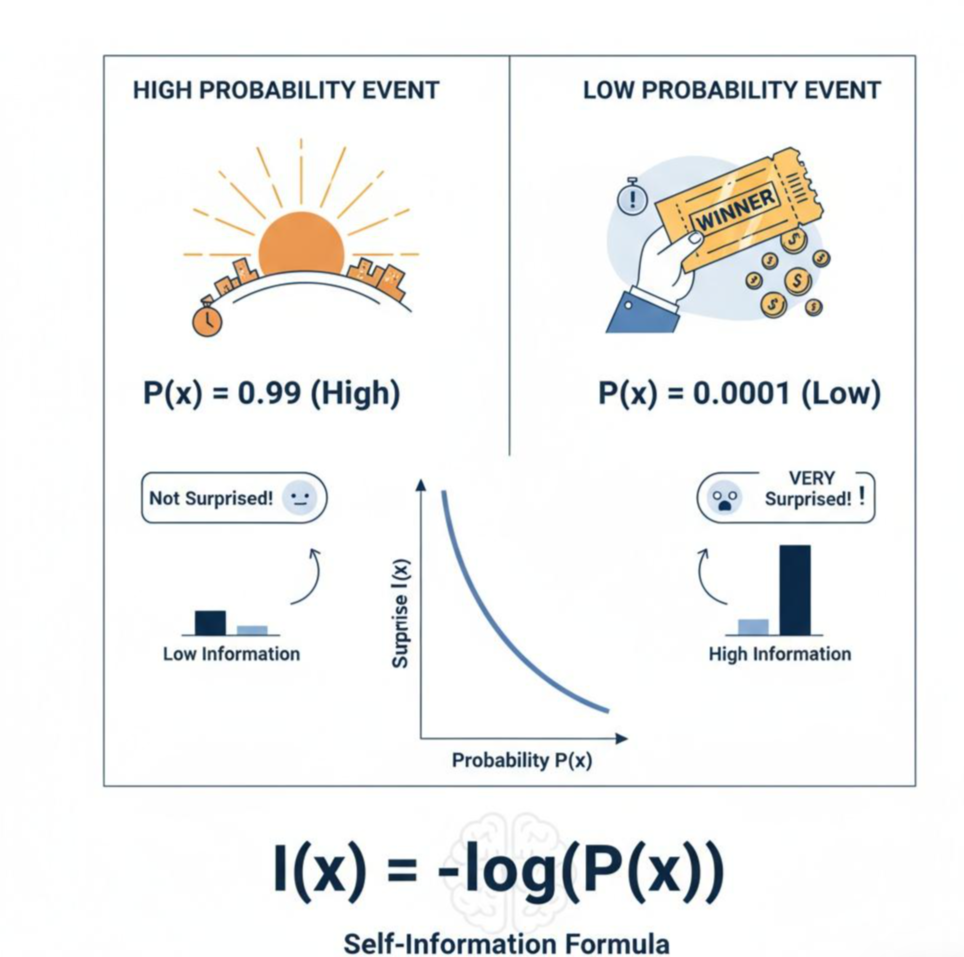

# 近端策略优化（PPO）算法完整笔记
## 一、PPO 的动机：为什么提出 PPO？
传统策略梯度方法（REINFORCE 等）存在核心缺陷：
1. **样本效率极低**：采集的样本只能使用一次，无法复用
2. **更新步长难以控制**：步长过大会导致策略崩溃，步长过小收敛极慢
3. **训练稳定性差**：算法性能波动剧烈

TRPO（信任区域策略优化）通过限制新旧策略的 KL 散度实现稳定更新，但**计算复杂、难以实现、速度慢**。

PPO 的核心目标：**保留 TRPO 的稳定性，同时简化计算、易于实现、提升效率**。

---

## 二、PPO 核心数学原理：裁剪目标函数
### 2.1 PPO-Clip 核心公式
PPO 最核心的裁剪目标函数：
$$
J_{PPO}(\theta) = \mathbb{E} \left[ \min\left( r_t(\theta) A_t, \text{clip}(r_t(\theta), 1-\epsilon, 1+\epsilon) A_t \right) \right]
$$

### 2.2 关键符号定义
1. **重要性权重**
$$
r_t(\theta) = \frac{\pi_\theta(a_t|s_t)}{\pi_{\theta_{\text{old}}}(a_t|s_t)}
$$
- $\pi_\theta$：待优化的新策略
- $\pi_{\theta_{\text{old}}}$：采样数据时使用的旧策略
- 作用：衡量新旧策略对同一动作的概率差异

2. **优势函数** $A_t$
- $A_t>0$：当前动作优于平均水平，为**好动作**
- $A_t<0$：当前动作劣于平均水平，为**坏动作**

3. **裁剪系数** $\epsilon$
- 通常取 $0.1\sim0.2$，限制策略更新的最大幅度

### 2.3 裁剪机制的直观理解
- **当 $A_t>0$（好动作）**
  希望提升动作概率，但裁剪限制 $r_t \le 1+\epsilon$，防止策略更新幅度过大
- **当 $A_t<0$（坏动作）**
  希望降低动作概率，但裁剪限制 $r_t \ge 1-\epsilon$，防止策略过度抑制

$\min$ 函数作用：选择更保守的更新方向，保证策略在**安全区域**内更新。

### 2.4 两个核心概念澄清
1. **双策略机制**
实际训练仅维护一套参数 $\theta$，$\theta_{\text{old}}$ 是参数的**历史快照**，用于固定采样分布，保证多轮更新的稳定性。

2. **重要性采样的作用**
PPO 中的重要性权重**不重新采样数据**，仅用于校正旧策略采样带来的分布偏差，实现样本复用。

---

## 三、广义优势估计（GAE）
PPO 通常搭配 GAE 使用，用于平衡优势函数估计的**偏差与方差**：
$$
A_t^{GAE} = \sum_{l=0}^{\infty} (\gamma\lambda)^l \delta_{t+l}
$$
单步 TD 误差：
$$
\delta_t = r_t + \gamma V(s_{t+1}) - V(s_t)
$$

- $\lambda=0$：单步 TD 误差，**高偏差、低方差**
- $\lambda=1$：蒙特卡洛回报，**低偏差、高方差**
- GAE 通过 $\lambda$ 自由调节偏差与方差的平衡

---

## 四、PPO 完整算法流程（Actor-Critic 架构）
### 算法步骤
1. 初始化策略网络 $\theta$、价值网络 $\phi$
2. **迭代循环**：
   - 复制当前参数，生成旧策略 $\theta_{\text{old}} \leftarrow \theta$
   - 使用 $\pi_{\theta_{\text{old}}}$ 与环境交互，采集一批轨迹数据
   - 利用价值网络 $V_\phi$ 和 GAE 计算优势函数 $A_t$ 与回报目标
   - **多轮梯度更新**（K 次，如 10 轮）：
     - 随机采样小批量数据
     - 计算重要性权重 $r_t(\theta)$
     - 计算 PPO 裁剪损失、价值损失、熵正则项
     - 同步更新策略网络与价值网络
3. 循环至收敛

---

## 五、PPO 损失函数完整形式
### 1. 策略损失（PPO-Clip）
$$
\mathcal{L}_{\text{clip}}(\theta) = \mathbb{E}\left[\min\left(r_t A_t, \text{clip}(r_t,1-\epsilon,1+\epsilon)A_t\right)\right]
$$

### 2. 价值损失
$$
\mathcal{L}_{\text{vf}}(\phi) = \mathbb{E}\left[(V_\phi(s_t)-\hat{G}_t)^2\right]
$$

### 3. 熵正则项（保证探索）
$$
\mathcal{L}_{\text{ent}} = \mathbb{E}\left[ H(\pi_\theta(\cdot|s_t)) \right]
$$

### 总损失
$$
\mathcal{L} = \mathcal{L}_{\text{clip}} + c_1 \mathcal{L}_{\text{vf}} - c_2 \mathcal{L}_{\text{ent}}
$$
- $c_1,c_2$ 为损失权重系数

# 相关知识点

## KL散度（Kullback-Leibler Divergence） 参考：https://zhuanlan.zhihu.com/p/1950257135775642370

### 一、核心思想与直观理解：从“意外”到“代价”

KL 散度（Kullback-Leibler Divergence），也称**相对熵**，其核心思想可以用一句话概括：**它精确地衡量了当我们用一个近似概率分布 Q 来建模一个真实概率分布 P 时，所引入的平均信息损失。**

* **真实分布 P**：如同一座城市的完美、实时的卫星地图。
* **近似分布 Q**：如同一份简化的、可能过时的手绘地图。
* **KL 散度**：就是您依赖手绘地图（Q）而非真实世界（P）进行导航时，所付出的**平均“绕路代价”**。地图越不准，您付出的额外精力（代价）就越大。

### 二、数学定义与信息论根源：一步步构建公式

KL 散度的公式并非凭空而来，它可以从信息论中的“**自信息**”（Self-Information，即一个事件发生带来的“意外程度”）自然推导出来。

1. **量化“意外”**：一个事件 x 的“自信息”为 **I(x) = -log(P(x))**。概率越低的事件，发生时带来的信息量（意外程度）越大。
  
3. **计算单个事件的“认知偏差”**：对于同一个事件 x，用我们的模型 Q 去认知它，与真实世界 P 的“意外程度”之差，就是这次认知的代价：
   **Cost(x) = [-log(Q(x))] - [-log(P(x))] = log(P(x) / Q(x))**。
4. **计算期望的总代价**：要对模型 Q 的整体表现进行评估，需要按事件在真实世界中的发生概率 **P(x)** 进行加权平均。这就得到了 KL 散度的公式：
   **D₀L(P || Q) = ∑ P(x) * log(P(x) / Q(x))** （离散形式）
   或 **D₀L(P || Q) = ∫ p(x) * log(p(x) / q(x)) dx** （连续形式）

**信息论视角的升华**：

KL 散度与“熵”（Entropy）和“交叉熵”（Cross-Entropy）紧密相关：

* **熵 H(P)**：对来自真实分布 P 的数据进行最优编码所需的平均码长。
* **交叉熵 H(P, Q)**：用基于近似分布 Q 设计的编码，去编码真实数据 P 时所需的实际平均码长。
* **KL 散度**正是两者的差值： **D₀L(P || Q) = H(P, Q) - H(P)**。
  这精确地量化了“用次优编码方案”所导致的**平均编码长度增量**，也就是我们一直在说的“额外代价”或“信息损失”。

### 三、关键特性：不对称性带来的深刻影响

KL 散度最重要的特性是**不对称性**，即 **D₀L(P || Q) ≠ D₀L(Q || P)**。

| 特性         | (正向KL)                                                             | (反向KL)                                                                 |
| ------------ | -------------------------------------------------------------------- | ------------------------------------------------------------------------ |
| **目标**     | 用模型 Q 拟合真实 P                                                  | 用模型 P 拟合真实 Q                                                      |
| **核心要求** | **Zero-avoiding**：Q 必须覆盖所有 P 中概率>0的区域，否则代价无穷大。 | **Mean-seeking**：P 需在 Q 概率高的区域集中质量，可忽略 Q 的低概率区域。 |
| **行为倾向** | Q 的分布会比 P 更宽、更分散，避免“漏报”。                          | P 的分布会倾向于更窄、更集中，寻找 Q 的众数，避免“虚报”。              |
| **通俗解释** | “宁可错杀，不可放过”                                               | “宁可放过，不可错杀”                                                   |

### 四、从理论到实践的挑战：大模型中的“不可能任务”

直接计算 KL 散度面临的两大工程挑战：

1. **计算量爆炸**：要计算 D₀L(π_ref || π)，需要对**词汇表中所有词元**（例如5万个）的概率进行求和。这意味着每个生成步骤都要两个模型分别做完整的前向传播，并进行数万次运算，完全不可行。
2. **内存/显存限制**：现代训练框架为了效率，在生成一个词元后，会立即丢弃那个巨大的（如5万维）完整概率向量，只保留被选中词元的概率。这导致计算 KL 散度的“原材料”在内存中根本不存在。

因此，我们无法进行精确计算，只能退而求其次，进行“**管中窥豹**”式的**估计**。

### 五、解决之道：优雅的估计器设计

通过**蒙特卡洛采样**和**重要性采样**来设计估计器。这是理解现代 RLHF（如 PPO、GRPO 算法）的关键。

#### 核心问题

我们需要估计 D₀L(π_ref || π) = **Eₓ~π_ref** [-log(π(x)/π_ref(x))]，但我们的样本 **x 却是从当前模型 π 中采样**得到的。

#### 解决方案：重要性采样

利用重要性采样公式，可以将期望巧妙地转换：
**Eₓ~π_ref [f(x)] = Eₓ~π [ (π_ref(x)/π(x)) * f(x) ]**

将 f(x) = -log(π(x)/π_ref(x)) 代入，并令概率比 ρ(x) = π(x)/π_ref(x)，经过推导可以得到一个基于 π 采样的估计器。

对比两种估计器：

| 特性         | **k₁ 估计器 (朴素蒙特卡洛)**                                              | **k₃ 估计器 (带控制变量)**                                                                          |
| :----------- | :------------------------------------------------------------------------- | :--------------------------------------------------------------------------------------------------- |
| **核心公式** | -log ρ(x)                                                                 | -log ρ(x) + (ρ(x) - 1)                                                                             |
| **比喻**     | **情绪化的评论家**：诚实但易大惊小怪。                                     | **理性的评论家**：诚实且配有校准工具。                                                               |
| **偏差**     | **无偏**                                                                   | **无偏**                                                                                             |
| **方差**     | **高**：一个离群值（如 ρ(x)→0）会使 -log ρ(x)→∞，导致估计值剧烈震荡。 | **低**：新增的校正项 (ρ(x)-1) 在 ρ(x) 极小时会提供负值，有效中和过大的正向波动，像一个“减震器”。 |
| **优点**     | 简单直观。                                                                 | 稳定性极佳，且恒为非负，符合 KL 散度定义，是 GRPO 等先进算法的选择。                                 |
| **缺点**     | 稳定性差，易导致训练震荡。                                                 | 公式稍显复杂，但收益远超成本。                                                                       |

k₃ 估计器的精妙之处在于，校正项 (ρ(x)-1) 的期望值为零，保证了**无偏性**；同时它与 -log ρ(x) 呈**负相关**，有效降低了**方差**。这体现了在工程限制下，通过精巧的数学工具（控制变量法）在“理论完美”和“现实可行”之间取得平衡的智慧。

### 总结

1. **KL 散度的本质**：从信息论看，它是用近似分布编码真实分布时，平均所需的**额外比特数**；从直观上看，它是使用错误地图的**平均绕路代价**。
2. **关键特性**：它的**不对称性**赋予了它在不同优化目标下（覆盖性 vs. 集中性）独特的应用含义。
3. **实践挑战**：在大模型中，由于**计算量**和**内存限制**，精确计算是“不可能的任务”。
4. **工程智慧**：我们通过**蒙特卡洛估计**和**重要性采样**等技术来近似。其中，像 **k₃ 这样的高级估计器**，通过引入控制变量，在保持**无偏**的同时大幅降低了**方差**，确保了训练过程的稳定，是数学理论在工程现实中优雅落地的典范。

希望这个结构化的梳理能帮助你更深刻地理解 KL 散度。如果你对其中的某个环节，比如重要性采样的数学推导或不同估计器的应用场景有更深入的兴趣，我们可以继续探讨。

## 信息量（Self-Information）：

一个事件发生的信息量定义为：$I(x) = -\log P(x)$
概率越小的事件，包含的信息量越大
例如："太阳从东边升起"（高概率）vs "中彩票"（低概率）
熵（Entropy）：

衡量随机变量的不确定性：$H(P) = -\sum_{i} P(x_i) \log P(x_i)$
熵越大，不确定性越大
交叉熵（Cross-Entropy）：

衡量两个概率分布之间的差异：$H(P, Q) = -\sum_{i} P(x_i) \log Q(x_i)$
其中 $P$ 是真实分布，$Q$ 是预测分布
从极大似然估计到交叉熵
假设我们有训练数据 ${(x_1, y_1), (x_2, y_2), ..., (x_n, y_n)}$，其中 $y_i$ 是真实标签。

## 似然函数：

$$ L(\theta) = \prod_{i=1}^{n} P(y_i | x_i; \theta) $$

对数似然：

$$ \log L(\theta) = \sum_{i=1}^{n} \log P(y_i | x_i; \theta) $$

最大化对数似然 = 最小化负对数似然：

$$ \text{Loss} = -\frac{1}{n}\sum_{i=1}^{n} \log P(y_i | x_i; \theta) $$

这就是 交叉熵损失 ！

## 从 KL 散度到交叉熵
KL散度衡量两个分布的差异：

$$ D_{KL}(P||Q) = \sum_{i} P(x_i) \log \frac{P(x_i)}{Q(x_i)} = \sum_{i} P(x_i) \log P(x_i) - \sum_{i} P(x_i) \log Q(x_i) $$

$$ D_{KL}(P||Q) = -H(P) + H(P,Q) $$

其中：

$H(P) = -\sum_{i} P(x_i) \log P(x_i)$ 是真实分布的熵（常数）
$H(P,Q) = -\sum_{i} P(x_i) \log Q(x_i)$ 是交叉熵
最小化KL散度 = 最小化交叉熵（因为真实分布的熵是常数）

### 广义优势估计 (GAE) 
## 一、GAE 是什么
广义优势估计（Generalized Advantage Estimation，GAE）是 Actor-Critic 算法中**优势函数 $A(s_t,a_t)$ 的高效估计方法**，用于平衡估计的**偏差**与**方差**，是 PPO / A2C / TRPO 的标配组件。

优势函数定义：
$$
A(s_t,a_t) = Q(s_t,a_t) - V(s_t)
$$

---

## 二、为什么需要 GAE
### 1. 蒙特卡洛（MC）估计
$$
A_t^{MC} = G_t - V(s_t), \quad G_t = \sum_{l=0}^\infty \gamma^l r_{t+l}
$$
- 优点：**无偏**
- 缺点：**方差极大**，训练不稳定

### 2. 单步 TD 估计
$$
A_t^{TD} = r_t + \gamma V(s_{t+1}) - V(s_t)
$$
- 优点：**方差小**
- 缺点：**有偏**，依赖价值函数精度

### 3. GAE 的定位
GAE 可以**在 MC 与 TD 之间平滑过渡**，用一个超参数 $\lambda$ 控制偏差–方差权衡。

---

## 三、GAE 核心公式
### 1. TD 误差
$$
\delta_t = r_t + \gamma V(s_{t+1}) - V(s_t)
$$

### 2. GAE 定义
$$
\hat{A}_t^{\text{GAE}(\gamma,\lambda)} = \sum_{l=0}^{\infty} (\gamma \lambda)^l \delta_{t+l}
$$

展开形式：
$$
\hat{A}_t = \delta_t + \gamma\lambda \delta_{t+1} + (\gamma\lambda)^2 \delta_{t+2} + \dots
$$

---

## 四、$\lambda$ 的作用（最关键）
### 1. $\lambda=0$
$$
\hat{A}_t = \delta_t
$$
等价**单步 TD 优势**
- 方差小
- 偏差大

### 2. $\lambda=1$
$$
\hat{A}_t = \sum_{l=0}^\infty \gamma^l \delta_{t+l} = G_t - V(s_t)
$$
等价**蒙特卡洛优势**
- 无偏
- 方差大

### 3. $0<\lambda<1$（常用 0.95 / 0.99）
- 累积多步 TD 误差
- **偏差小 + 方差小**
- 实际训练最稳定

---

## 五、GAE 直观理解
GAE = **未来所有 TD 误差的指数加权和**
- 权重：$(\gamma\lambda)^l$
- 越远的时间步，权重越小
- 自动平衡短期（低方差）与长期（低偏差）信息

---

## 六、GAE 高效计算（反向递推）
实际代码中**从后往前递推**，复杂度 $O(T)$：

$$
\begin{aligned}
\hat{A}_T &= 0 \\
\hat{A}_t &= \delta_t + \gamma\lambda \cdot \hat{A}_{t+1}
\end{aligned}
$$

---

## 七、GAE 在 PPO 中的用途
1. **计算优势 $A_t$**：用于 PPO-Clip 损失
2. **计算价值目标**
$$
V_t^\text{target} = A_t^\text{GAE} + V(s_t)
$$

